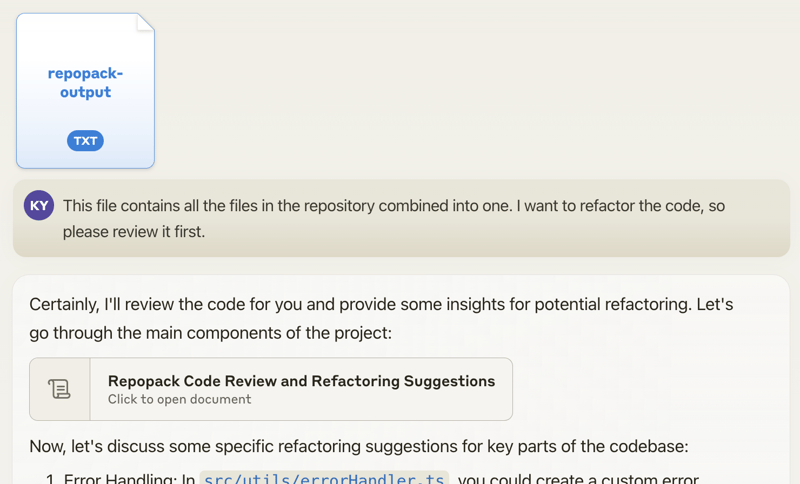
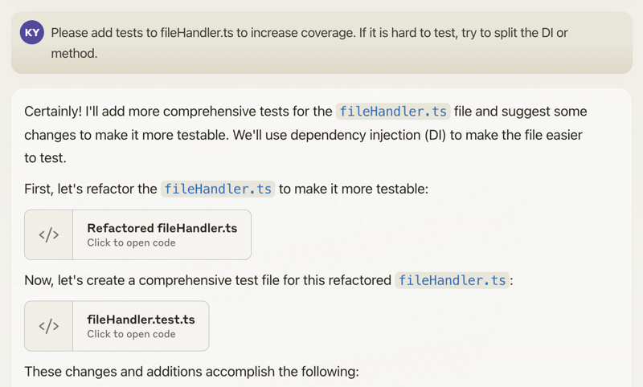

<div align="center">
  <a href="https://repomix.com">
    
  </a>
  <p align="center">
    <b>Pack your codebase into AI-friendly formats</b>
  </p>
</div>

<hr />

<p align="center">
  <a href="https://repomix.com"><b>Use Repomix online! 👉 repomix.com</b></a><br>
</p>

<p align="center">
  Need discussion? Join us on <a href="https://discord.gg/wNYzTwZFku">Discord</a>!<br>
  <i>Share your experience and tips</i><br>
  <i>Stay updated on new features</i><br>
  <i>Get help with configuration and usage</i><br>
</p>

<hr />

[](https://www.npmjs.com/package/repomix)
[](https://www.npmjs.com/package/repomix)
[](https://github.com/yamadashy/repomix/blob/main/LICENSE)
[](https://www.npmjs.com/package/repomix)
[](https://github.com/yamadashy/repomix/actions?query=workflow%3A"ci")
[](https://codecov.io/github/yamadashy/repomix)

[![DeepWiki](https://img.shields.io/badge/DeepWiki-yamadashy%2Frepomix-blue.svg?logo=data:image/png;base64,iVBORw0KGgoAAAANSUhEUgAAACwAAAAyCAYAAAAnWDnqAAAAAXNSR0IArs4c6QAAA05JREFUaEPtmUtyEzEQhtWTQyQLHNak2AB7ZnyXZMEjXMGeK/AIi+QuHrMnbChYY7MIh8g01fJoopFb0uhhEqqcbWTp06/uv1saEDv4O3n3dV60RfP947Mm9/SQc0ICFQgzfc4CYZoTPAswgSJCCUJUnAAoRHOAUOcATwbmVLWdGoH//PB8mnKqScAhsD0kYP3j/Yt5LPQe2KvcXmGvRHcDnpxfL2zOYJ1mFwrryWTz0advv1Ut4CJgf5uhDuDj5eUcAUoahrdY/56ebRWeraTjMt/00Sh3UDtjgHtQNHwcRGOC98BJEAEymycmYcWwOprTgcB6VZ5JK5TAJ+fXGLBm3FDAmn6oPPjR4rKCAoJCal2eAiQp2x0vxTPB3ALO2CRkwmDy5WohzBDwSEFKRwPbknEggCPB/imwrycgxX2NzoMCHhPkDwqYMr9tRcP5qNrMZHkVnOjRMWwLCcr8ohBVb1OMjxLwGCvjTikrsBOiA6fNyCrm8V1rP93iVPpwaE+gO0SsWmPiXB+jikdf6SizrT5qKasx5j8ABbHpFTx+vFXp9EnYQmLx02h1QTTrl6eDqxLnGjporxl3NL3agEvXdT0WmEost648sQOYAeJS9Q7bfUVoMGnjo4AZdUMQku50McDcMWcBPvr0SzbTAFDfvJqwLzgxwATnCgnp4wDl6Aa+Ax283gghmj+vj7feE2KBBRMW3FzOpLOADl0Isb5587h/U4gGvkt5v60Z1VLG8BhYjbzRwyQZemwAd6cCR5/XFWLYZRIMpX39AR0tjaGGiGzLVyhse5C9RKC6ai42ppWPKiBagOvaYk8lO7DajerabOZP46Lby5wKjw1HCRx7p9sVMOWGzb/vA1hwiWc6jm3MvQDTogQkiqIhJV0nBQBTU+3okKCFDy9WwferkHjtxib7t3xIUQtHxnIwtx4mpg26/HfwVNVDb4oI9RHmx5WGelRVlrtiw43zboCLaxv46AZeB3IlTkwouebTr1y2NjSpHz68WNFjHvupy3q8TFn3Hos2IAk4Ju5dCo8B3wP7VPr/FGaKiG+T+v+TQqIrOqMTL1VdWV1DdmcbO8KXBz6esmYWYKPwDL5b5FA1a0hwapHiom0r/cKaoqr+27/XcrS5UwSMbQAAAABJRU5ErkJggg==)](https://deepwiki.com/yamadashy/repomix)
<!-- DeepWiki badge generated by https://deepwiki.ryoppippi.com/ -->

📦 Repomix is a powerful tool that packs your entire repository into a single, AI-friendly file.  
It is perfect for when you need to feed your codebase to Large Language Models (LLMs) or other AI tools like Claude,
ChatGPT, DeepSeek, Perplexity, Gemini, Gemma, Llama, Grok, and more.

## 🎉 New: Repomix Website & Discord Community!

- Try Repomix in your browser at [repomix.com](https://repomix.com/)
- Join our [Discord Server](https://discord.gg/wNYzTwZFku) for support and discussion

**We look forward to seeing you there!**

## 🌟 Features

- **AI-Optimized**: Formats your codebase in a way that's easy for AI to understand and process.
- **Token Counting**: Provides token counts for each file and the entire repository, useful for LLM context limits.
- **Simple to Use**: You need just one command to pack your entire repository.
- **Customizable**: Easily configure what to include or exclude.
- **Git-Aware**: Automatically respects your `.gitignore` files and `.git/info/exclude`.
- **Security-Focused**: Incorporates [Secretlint](https://github.com/secretlint/secretlint) for robust security checks to detect and prevent inclusion of sensitive information.
- **Code Compression**: The `--compress` option uses [Tree-sitter](https://github.com/tree-sitter/tree-sitter) to extract key code elements, reducing token count while preserving structure.

## 🚀 Quick Start

### Using the CLI Tool `>_`

You can try Repomix instantly in your project directory without installation:

```bash
npx repomix
```

Or install globally for repeated use:

```bash
# Install using npm
npm install -g repomix

# Alternatively using yarn
yarn global add repomix

# Alternatively using Homebrew (macOS/Linux)
brew install repomix

# Then run in any project directory
repomix
```

That's it! Repomix will generate a `repomix-output.xml` file in your current directory, containing your entire
repository in an AI-friendly format.

You can then send this file to an AI assistant with a prompt like:

```
This file contains all the files in the repository combined into one.
I want to refactor the code, so please review it first.
```



When you propose specific changes, the AI might be able to generate code accordingly. With features like Claude's
Artifacts, you could potentially output multiple files, allowing for the generation of multiple interdependent pieces of
code.



Happy coding! 🚀

### Using The Website 🌐

Want to try it quickly? Visit the official website at [repomix.com](https://repomix.com). Simply enter your repository
name, fill in any optional details, and click the **Pack** button to see your generated output.

#### Available Options

The website offers several convenient features:

- Customizable output format (XML, Markdown, or Plain Text)
- Instant token count estimation
- Much more!

### Using The VSCode Extension ⚡️

A community-maintained VSCode extension called [Repomix Runner](https://marketplace.visualstudio.com/items?itemName=DorianMassoulier.repomix-runner) (created by [massdo](https://github.com/massdo)) lets you run Repomix right inside your editor with just a few clicks. Run it on any folder, manage outputs seamlessly, and control everything through VSCode's intuitive interface. 

Want your output as a file or just the content? Need automatic cleanup? This extension has you covered. Plus, it works smoothly with your existing repomix.config.json.

Try it now on the [VSCode Marketplace](https://marketplace.visualstudio.com/items?itemName=DorianMassoulier.repomix-runner)!
Source code is available on [GitHub](https://github.com/massdo/repomix-runner).

### Alternative Tools 🛠️

If you're using Python, you might want to check out `Gitingest`, which is better suited for Python ecosystem and data
science workflows:
https://github.com/cyclotruc/gitingest

## 📊 Usage

To pack your entire repository:

```bash
repomix
```

To pack a specific directory:

```bash
repomix path/to/directory
```

To pack specific files or directories
using [glob patterns](https://github.com/mrmlnc/fast-glob?tab=readme-ov-file#pattern-syntax):

```bash
repomix --include "src/**/*.ts,**/*.md"
```

To exclude specific files or directories:

```bash
repomix --ignore "**/*.log,tmp/"
```

To pack a remote repository:

```bash
repomix --remote https://github.com/yamadashy/repomix

# You can also use GitHub shorthand:
repomix --remote yamadashy/repomix

# You can specify the branch name, tag, or commit hash:
repomix --remote https://github.com/yamadashy/repomix --remote-branch main

# Or use a specific commit hash:
repomix --remote https://github.com/yamadashy/repomix --remote-branch 935b695

# Another convenient way is specifying the branch's URL
repomix --remote https://github.com/yamadashy/repomix/tree/main

# Commit's URL is also supported
repomix --remote https://github.com/yamadashy/repomix/commit/836abcd7335137228ad77feb28655d85712680f1

```

To compress the output:

```bash
repomix --compress

# You can also use it with remote repositories:
repomix --remote yamadashy/repomix --compress
```

To initialize a new configuration file (`repomix.config.json`):

```bash
repomix --init
```

Once you have generated the packed file, you can use it with Generative AI tools like ChatGPT, DeepSeek, Perplexity, Gemini, Gemma, Llama, Grok, and more.

### Docker Usage 🐳

You can also run Repomix using Docker.  
This is useful if you want to run Repomix in an isolated environment or prefer using containers.

Basic usage (current directory):

```bash
docker run -v .:/app -it --rm ghcr.io/yamadashy/repomix
```

To pack a specific directory:

```bash
docker run -v .:/app -it --rm ghcr.io/yamadashy/repomix path/to/directory
```

Process a remote repository and output to a `output` directory:

```bash
docker run -v ./output:/app -it --rm ghcr.io/yamadashy/repomix --remote https://github.com/yamadashy/repomix
```

### Prompt Examples

Once you have generated the packed file with Repomix, you can use it with AI tools like ChatGPT, DeepSeek, Perplexity, Gemini, Gemma, Llama, Grok, and more.
Here are some example prompts to get you started:

#### Code Review and Refactoring

For a comprehensive code review and refactoring suggestions:

```
This file contains my entire codebase. Please review the overall structure and suggest any improvements or refactoring opportunities, focusing on maintainability and scalability.
```

#### Documentation Generation

To generate project documentation:

```
Based on the codebase in this file, please generate a detailed README.md that includes an overview of the project, its main features, setup instructions, and usage examples.
```

#### Test Case Generation

For generating test cases:

```
Analyze the code in this file and suggest a comprehensive set of unit tests for the main functions and classes. Include edge cases and potential error scenarios.
```

#### Code Quality Assessment

Evaluate code quality and adherence to best practices:

```
Review the codebase for adherence to coding best practices and industry standards. Identify areas where the code could be improved in terms of readability, maintainability, and efficiency. Suggest specific changes to align the code with best practices.
```

#### Library Overview

Get a high-level understanding of the library

```
This file contains the entire codebase of library. Please provide a comprehensive overview of the library, including its main purpose, key features, and overall architecture.
```

Feel free to modify these prompts based on your specific needs and the capabilities of the AI tool you're using.

### Community Discussion

Check out our [community discussion](https://github.com/yamadashy/repomix/discussions/154) where users share:

- Which AI tools they're using with Repomix
- Effective prompts they've discovered
- How Repomix has helped them
- Tips and tricks for getting the most out of AI code analysis

Feel free to join the discussion and share your own experiences! Your insights could help others make better use of
Repomix.

### Output File Format

Repomix generates a single file with clear separators between different parts of your codebase.  
To enhance AI comprehension, the output file begins with an AI-oriented explanation, making it easier for AI models to
understand the context and structure of the packed repository.

#### XML Format (default)

The XML format structures the content in a hierarchical manner:

```xml
This file is a merged representation of the entire codebase, combining all repository files into a single document.

<file_summary>
  (Metadata and usage AI instructions)
</file_summary>

<directory_structure>
src/
cli/
cliOutput.ts
index.ts

(...remaining directories)
</directory_structure>

<files>
<file path="src/index.js">
  // File contents here
</file>

(...remaining files)
</files>

<instruction>
(Custom instructions from `output.instructionFilePath`)
</instruction>
```

For those interested in the potential of XML tags in AI contexts:  
https://docs.anthropic.com/en/docs/build-with-claude/prompt-engineering/use-xml-tags

> When your prompts involve multiple components like context, instructions, and examples, XML tags can be a
> game-changer. They help Claude parse your prompts more accurately, leading to higher-quality outputs.

This means that the XML output from Repomix is not just a different format, but potentially a more effective way to feed
your codebase into AI systems for analysis, code review, or other tasks.

#### Markdown Format

To generate output in Markdown format, use the `--style markdown` option:

```bash
repomix --style markdown
```

The Markdown format structures the content in a hierarchical manner:

````markdown
This file is a merged representation of the entire codebase, combining all repository files into a single document.

# File Summary

(Metadata and usage AI instructions)

# Repository Structure

```
src/
  cli/
    cliOutput.ts
    index.ts
```

(...remaining directories)

# Repository Files

## File: src/index.js

```
// File contents here
```

(...remaining files)

# Instruction

(Custom instructions from `output.instructionFilePath`)
````

This format provides a clean, readable structure that is both human-friendly and easily parseable by AI systems.

#### Plain Text Format

To generate output in plain text format, use the `--style plain` option:

```bash
repomix --style plain
```

```text
This file is a merged representation of the entire codebase, combining all repository files into a single document.

================================================================
File Summary
================================================================
(Metadata and usage AI instructions)

================================================================
Directory Structure
================================================================
src/
  cli/
    cliOutput.ts
    index.ts
  config/
    configLoader.ts

(...remaining directories)

================================================================
Files
================================================================

================
File: src/index.js
================
// File contents here

================
File: src/utils.js
================
// File contents here

(...remaining files)

================================================================
Instruction
================================================================
(Custom instructions from `output.instructionFilePath`)
```

### Command Line Options

#### Basic Options
- `-v, --version`: Show tool version

#### Output Options
- `-o, --output <file>`: Specify the output file name
- `--style <style>`: Specify the output style (`xml`, `markdown`, `plain`)
- `--parsable-style`: Enable parsable output based on the chosen style schema. Note that this can increase token count.
- `--compress`: Perform intelligent code extraction, focusing on essential function and class signatures to reduce token count
- `--output-show-line-numbers`: Show line numbers in the output
- `--copy`: Additionally copy generated output to system clipboard
- `--no-file-summary`: Disable file summary section output
- `--no-directory-structure`: Disable directory structure section output
- `--remove-comments`: Remove comments from supported file types
- `--remove-empty-lines`: Remove empty lines from the output
- `--header-text <text>`: Custom text to include in the file header
- `--instruction-file-path <path>`: Path to a file containing detailed custom instructions
- `--include-empty-directories`: Include empty directories in the output
- `--no-git-sort-by-changes`: Disable sorting files by git change count (enabled by default)

#### Filter Options
- `--include <patterns>`: List of include patterns (comma-separated)
- `-i, --ignore <patterns>`: Additional ignore patterns (comma-separated)
- `--no-gitignore`: Disable .gitignore file usage
- `--no-default-patterns`: Disable default patterns

#### Remote Repository Options
- `--remote <url>`: Process a remote Git repository
- `--remote-branch <name>`: Specify the remote branch name, tag, or commit hash (defaults to repository default branch)

#### Configuration Options
- `-c, --config <path>`: Path to a custom config file
- `--init`: Create config file
- `--global`: Use global config

#### Security Options
- `--no-security-check`: Disable security check

#### Token Count Options
- `--token-count-encoding <encoding>`: Specify token count encoding used by OpenAI's [tiktoken](https://github.com/openai/tiktoken) tokenizer (e.g., `o200k_base` for GPT-4o, `cl100k_base` for GPT-4/3.5). See [tiktoken model.py](https://github.com/openai/tiktoken/blob/main/tiktoken/model.py#L24) for encoding details.

#### MCP
- `--mcp`: Run as a [MCP (Model Context Protocol)](https://modelcontextprotocol.io) server

#### Other Options
- `--top-files-len <number>`: Number of top files to display in the summary
- `--verbose`: Enable verbose logging
- `--quiet`: Disable all output to stdout

Examples:

```bash
repomix -o custom-output.txt
repomix -i "*.log,tmp" -v
repomix -c ./custom-config.json
repomix --style xml
repomix --remote https://github.com/user/repo
npx repomix src
```

### Updating Repomix

To update a globally installed Repomix:

```bash
# Using npm
npm update -g repomix

# Using yarn
yarn global upgrade repomix
```

Using `npx repomix` is generally more convenient as it always uses the latest version.

### Remote Repository Processing

Repomix supports processing remote Git repositories without the need for manual cloning. This feature allows you to
quickly analyze any public Git repository with a single command.

To process a remote repository, use the `--remote` option followed by the repository URL:

```bash
repomix --remote https://github.com/yamadashy/repomix
```

You can also use GitHub's shorthand format:

```bash
repomix --remote yamadashy/repomix
```

You can specify the branch name, tag, or commit hash:

```bash
# Using --remote-branch option
repomix --remote https://github.com/yamadashy/repomix --remote-branch main

# Using branch's URL
repomix --remote https://github.com/yamadashy/repomix/tree/main
```

Or use a specific commit hash:

```bash
# Using --remote-branch option
repomix --remote https://github.com/yamadashy/repomix --remote-branch 935b695

# Using commit's URL
repomix --remote https://github.com/yamadashy/repomix/commit/836abcd7335137228ad77feb28655d85712680f1
```

### Code Compression

The `--compress` option utilizes [Tree-sitter](https://github.com/tree-sitter/tree-sitter) to perform intelligent code extraction, focusing on essential function and class signatures while removing implementation details. This can help reduce token count while retaining important structural information.

```bash
repomix --compress
```

For example, this code:

```typescript
import { ShoppingItem } from './shopping-item';

/**
 * Calculate the total price of shopping items
 */
const calculateTotal = (
  items: ShoppingItem[]
) => {
  let total = 0;
  for (const item of items) {
    total += item.price * item.quantity;
  }
  return total;
}

// Shopping item interface
interface Item {
  name: string;
  price: number;
  quantity: number;
}
```

Will be compressed to:

```typescript
import { ShoppingItem } from './shopping-item';
⋮----
/**
 * Calculate the total price of shopping items
 */
const calculateTotal = (
  items: ShoppingItem[]
) => {
⋮----
// Shopping item interface
interface Item {
  name: string;
  price: number;
  quantity: number;
}
```

> [!NOTE]
> This is an experimental feature that we'll be actively improving based on user feedback and real-world usage

### MCP Server Integration

Repomix supports the [Model Context Protocol (MCP)](https://modelcontextprotocol.io), allowing AI assistants to directly interact with your codebase. When run as an MCP server, Repomix provides tools that enable AI assistants to package local or remote repositories for analysis without requiring manual file preparation.

```bash
repomix --mcp
```

#### Configuring MCP Servers

To use Repomix as an MCP server with AI assistants like Claude, you need to configure the MCP settings:

**For VS Code:**

You can install the Repomix MCP server in VS Code using one of these methods:

1. **Using the Install Badge:**

  [](https://insiders.vscode.dev/redirect/mcp/install?name=repomix&config=%7B%22command%22%3A%22npx%22%2C%22args%22%3A%5B%22-y%22%2C%22repomix%22%2C%22--mcp%22%5D%7D)
  [](https://insiders.vscode.dev/redirect/mcp/install?name=repomix&config=%7B%22command%22%3A%22npx%22%2C%22args%22%3A%5B%22-y%22%2C%22repomix%22%2C%22--mcp%22%5D%7D&quality=insiders)

2. **Using the Command Line:**

  ```bash
  code --add-mcp '{"name":"repomix","command":"npx","args":["-y","repomix","--mcp"]}'
  ```

  For VS Code Insiders:
  ```bash
  code-insiders --add-mcp '{"name":"repomix","command":"npx","args":["-y","repomix","--mcp"]}'
  ```

**For Cline (VS Code extension):**

Edit the `cline_mcp_settings.json` file:
```json
{
  "mcpServers": {
    "repomix": {
      "command": "npx",
      "args": [
        "-y",
        "repomix",
        "--mcp"
      ]
    }
  }
}
```

**For Cursor:**

In Cursor, add a new MCP server from `Cursor Settings` > `MCP` > `+ Add new global MCP server` with a configuration similar to Cline.

**For Claude Desktop:**

Edit the `claude_desktop_config.json` file with similar configuration to Cline's config.

Once configured, your AI assistant can directly use Repomix's capabilities to analyze codebases without manual file preparation, making code analysis workflows more efficient.

#### Available MCP Tools

When running as an MCP server, Repomix provides the following tools:

1. **pack_codebase**: Package a local code directory into a consolidated file for AI analysis
  - Parameters:
    - `directory`: Absolute path to the directory to pack
    - `compress`: (Optional, default: true) Whether to perform intelligent code extraction
    - `includePatterns`: (Optional) Comma-separated list of include patterns
    - `ignorePatterns`: (Optional) Comma-separated list of ignore patterns

2. **pack_remote_repository**: Fetch, clone and package a GitHub repository
  - Parameters:
    - `remote`: GitHub repository URL or user/repo format (e.g., yamadashy/repomix)
    - `compress`: (Optional, default: true) Whether to perform intelligent code extraction
    - `includePatterns`: (Optional) Comma-separated list of include patterns
    - `ignorePatterns`: (Optional) Comma-separated list of ignore patterns

3. **read_repomix_output**: Read the contents of a Repomix output file in environments where direct file access is not possible
  - Parameters:
    - `outputId`: ID of the Repomix output file to read
  - Features:
    - Specifically designed for web-based environments or sandboxed applications
    - Retrieves the content of previously generated outputs using their ID
    - Provides secure access to packed codebase without requiring file system access

4. **file_system_read_file**: Read a file using an absolute path with security validation
  - Parameters:
    - `path`: Absolute path to the file to read
  - Security features:
    - Implements security validation using [Secretlint](https://github.com/secretlint/secretlint)
    - Prevents access to files containing sensitive information
    - Validates absolute paths to prevent directory traversal attacks

5. **file_system_read_directory**: List contents of a directory using an absolute path
  - Parameters:
    - `path`: Absolute path to the directory to list
  - Features:
    - Shows files and directories with clear indicators (`[FILE]` or `[DIR]`)
    - Provides safe directory traversal with proper error handling
    - Validates paths and ensures they are absolute

## ⚙️ Configuration

Create a `repomix.config.json` file in your project root for custom configurations.

```bash
repomix --init
```

Here's an explanation of the configuration options:

| Option                           | Description                                                                                                                  | Default                |
|----------------------------------|------------------------------------------------------------------------------------------------------------------------------|------------------------|
| `output.filePath`                | The name of the output file                                                                                                  | `"repomix-output.xml"` |
| `output.style`                   | The style of the output (`xml`, `markdown`, `plain`)                                                                         | `"xml"`                |
| `output.parsableStyle`           | Whether to escape the output based on the chosen style schema. Note that this can increase token count.                      | `false`                |
| `output.compress`                | Whether to perform intelligent code extraction to reduce token count                                                         | `false`                |
| `output.headerText`              | Custom text to include in the file header                                                                                    | `null`                 |
| `output.instructionFilePath`     | Path to a file containing detailed custom instructions                                                                       | `null`                 |
| `output.fileSummary`             | Whether to include a summary section at the beginning of the output                                                          | `true`                 |
| `output.directoryStructure`      | Whether to include the directory structure in the output                                                                     | `true`                 |
| `output.removeComments`          | Whether to remove comments from supported file types                                                                         | `false`                |
| `output.removeEmptyLines`        | Whether to remove empty lines from the output                                                                                | `false`                |
| `output.showLineNumbers`         | Whether to add line numbers to each line in the output                                                                       | `false`                |
| `output.copyToClipboard`         | Whether to copy the output to system clipboard in addition to saving the file                                                | `false`                |
| `output.topFilesLength`          | Number of top files to display in the summary. If set to 0, no summary will be displayed                                     | `5`                    |
| `output.includeEmptyDirectories` | Whether to include empty directories in the repository structure                                                             | `false`                |
| `output.git.sortByChanges`       | Whether to sort files by git change count (files with more changes appear at the bottom)                                     | `true`                 |
| `output.git.sortByChangesMaxCommits` | Maximum number of commits to analyze for git changes                                                                     | `100`                  |
| `include`                        | Patterns of files to include (using [glob patterns](https://github.com/mrmlnc/fast-glob?tab=readme-ov-file#pattern-syntax))  | `[]`                   |
| `ignore.useGitignore`            | Whether to use patterns from the project's `.gitignore` file                                                                 | `true`                 |
| `ignore.useDefaultPatterns`      | Whether to use default ignore patterns                                                                                       | `true`                 |
| `ignore.customPatterns`          | Additional patterns to ignore (using [glob patterns](https://github.com/mrmlnc/fast-glob?tab=readme-ov-file#pattern-syntax)) | `[]`                   |
| `security.enableSecurityCheck`   | Whether to perform security checks on files                                                                                  | `true`                 |
| `tokenCount.encoding`            | Token count encoding used by OpenAI's [tiktoken](https://github.com/openai/tiktoken) tokenizer (e.g., `o200k_base` for GPT-4o, `cl100k_base` for GPT-4/3.5). See [tiktoken model.py](https://github.com/openai/tiktoken/blob/main/tiktoken/model.py#L24) for encoding details. | `"o200k_base"`         |

The configuration file supports [JSON5](https://json5.org/) syntax, which allows:
- Comments (both single-line and multi-line)
- Trailing commas in objects and arrays
- Unquoted property names
- More relaxed string syntax

Example configuration:

```json5
{
  "output": {
    "filePath": "repomix-output.xml",
    "style": "xml",
    "parsableStyle": true,
    "compress": false,
    "headerText": "Custom header information for the packed file.",
    "fileSummary": true,
    "directoryStructure": true,
    "removeComments": false,
    "removeEmptyLines": false,
    "showLineNumbers": false,
    "copyToClipboard": true,
    "topFilesLength": 5,
    "includeEmptyDirectories": false,
    "git": {
      "sortByChanges": true,
      "sortByChangesMaxCommits": 100
    }
  },
  "include": [
    "**/*"
  ],
  "ignore": {
    "useGitignore": true,
    "useDefaultPatterns": true,
    // Patterns can also be specified in .repomixignore
    "customPatterns": [
      "additional-folder",
      "**/*.log"
    ],
  },
  "security": {
    "enableSecurityCheck": true
  },
  "tokenCount": {
    "encoding": "o200k_base"
  },
}
```

### Global Configuration

To create a global configuration file:

```bash
repomix --init --global
```

The global configuration file will be created in:

- Windows: `%LOCALAPPDATA%\Repomix\repomix.config.json`
- macOS/Linux: `$XDG_CONFIG_HOME/repomix/repomix.config.json` or `~/.config/repomix/repomix.config.json`

Note: Local configuration (if present) takes precedence over global configuration.

### Include and Ignore

#### Include Patterns

Repomix now supports specifying files to include
using [glob patterns](https://github.com/mrmlnc/fast-glob?tab=readme-ov-file#pattern-syntax). This allows for more
flexible and powerful file selection:

- Use `**/*.js` to include all JavaScript files in any directory
- Use `src/**/*` to include all files within the `src` directory and its subdirectories
- Combine multiple patterns like `["src/**/*.js", "**/*.md"]` to include JavaScript files in `src` and all Markdown
  files

#### Ignore Patterns

Repomix offers multiple methods to set ignore patterns for excluding specific files or directories during the packing
process:

- **.gitignore**: By default, patterns listed in your project's `.gitignore` files and `.git/info/exclude` are used. This behavior can be controlled with the `ignore.useGitignore` setting or the `--no-gitignore` cli option.
- **Default patterns**: Repomix includes a default list of commonly excluded files and directories (e.g., node_modules,
  .git, binary files). This feature can be controlled with the `ignore.useDefaultPatterns` setting or the `--no-default-patterns` cli option. Please
  see [defaultIgnore.ts](src/config/defaultIgnore.ts) for more details.
- **.repomixignore**: You can create a `.repomixignore` file in your project root to define Repomix-specific ignore
  patterns. This file follows the same format as `.gitignore`.
- **Custom patterns**: Additional ignore patterns can be specified using the `ignore.customPatterns` option in the
  configuration file. You can overwrite this setting with the `-i, --ignore` command line option.

Priority Order (from highest to lowest):

1. Custom patterns `ignore.customPatterns`
2. `.repomixignore`
3. `.gitignore` and `.git/info/exclude` (if `ignore.useGitignore` is true and `--no-gitignore` is not used)
4. Default patterns (if `ignore.useDefaultPatterns` is true and `--no-default-patterns` is not used)

This approach allows for flexible file exclusion configuration based on your project's needs. It helps optimize the size
of the generated pack file by ensuring the exclusion of security-sensitive files and large binary files, while
preventing the leakage of confidential information.

Note: Binary files are not included in the packed output by default, but their paths are listed in the "Repository
Structure" section of the output file. This provides a complete overview of the repository structure while keeping the
packed file efficient and text-based.

### Custom Instruction

The `output.instructionFilePath` option allows you to specify a separate file containing detailed instructions or
context about your project. This allows AI systems to understand the specific context and requirements of your project,
potentially leading to more relevant and tailored analysis or suggestions.

Here's an example of how you might use this feature:

1. Create a file named `repomix-instruction.md` in your project root:

```markdown
# Coding Guidelines

- Follow the Airbnb JavaScript Style Guide
- Suggest splitting files into smaller, focused units when appropriate
- Add comments for non-obvious logic. Keep all text in English
- All new features should have corresponding unit tests

# Generate Comprehensive Output

- Include all content without abbreviation, unless specified otherwise
- Optimize for handling large codebases while maintaining output quality
```

2. In your `repomix.config.json`, add the `instructionFilePath` option:

```json5
{
  "output": {
    "instructionFilePath": "repomix-instruction.md",
    // other options...
  }
}
```

When Repomix generates the output, it will include the contents of `repomix-instruction.md` in a dedicated section.

Note: The instruction content is appended at the end of the output file. This placement can be particularly effective
for AI systems. For those interested in understanding why this might be beneficial, Anthropic provides some insights in
their documentation:  
https://docs.anthropic.com/en/docs/build-with-claude/prompt-engineering/long-context-tips

> Put long-form data at the top: Place your long documents and inputs (~20K+ tokens) near the top of your prompt, above
> your query, instructions, and examples. This can significantly improve Claude's performance across all models.
> Queries at the end can improve response quality by up to 30% in tests, especially with complex, multi-document inputs.

### Comment Removal

When `output.removeComments` is set to `true`, Repomix will attempt to remove comments from supported file types. This
feature can help reduce the size of the output file and focus on the essential code content.

Supported languages include:  
HTML, CSS, JavaScript, TypeScript, Vue, Svelte, Python, PHP, Ruby, C, C#, Java, Go, Rust, Swift, Kotlin, Dart, Shell,
and YAML.

Note: The comment removal process is conservative to avoid accidentally removing code. In complex cases, some comments
might be retained.

## 🔍 Security Check

Repomix includes a security check feature that uses [Secretlint](https://github.com/secretlint/secretlint) to detect
potentially sensitive information in your files. This feature helps you identify possible security risks before sharing
your packed repository.

The security check results will be displayed in the CLI output after the packing process is complete. If any suspicious
files are detected, you'll see a list of these files along with a warning message.

Example output:

```
🔍 Security Check:
──────────────────
2 suspicious file(s) detected:
1. src/utils/test.txt
2. tests/utils/secretLintUtils.test.ts

Please review these files for potentially sensitive information.
```

By default, Repomix's security check feature is enabled. You can disable it by setting `security.enableSecurityCheck` to
`false` in your configuration file:

```json
{
  "security": {
    "enableSecurityCheck": false
  }
}
```

Or using the `--no-security-check` command line option:

```bash
repomix --no-security-check
```

> [!NOTE]
> Disabling security checks may expose sensitive information. Use this option with caution and only when necessary, such
> as when working with test files or documentation that contains example credentials.

## 📚 Using Repomix as a Library

In addition to using Repomix as a CLI tool, you can also use it as a library in your Node.js applications.

### Installation

```bash
npm install repomix
```

### Basic Usage

```javascript
import { runCli, type CliOptions } from 'repomix';

// Process current directory with custom options
async function packProject() {
  const options = {
    output: 'output.xml',
    style: 'xml',
    compress: true,
    quiet: true
  } as CliOptions;
  
  const result = await runCli(['.'], process.cwd(), options);
  return result.packResult;
}
```

### Process Remote Repository

```javascript
import { runCli, type CliOptions } from 'repomix';

// Clone and process a GitHub repo
async function processRemoteRepo(repoUrl) {
  const options = {
    remote: repoUrl,
    output: 'output.xml',
    compress: true
  } as CliOptions;
  
  return await runCli(['.'], process.cwd(), options);
}
```

### Using Core Components

If you need more control, you can use the low-level APIs:

```javascript
import { searchFiles, collectFiles, processFiles, TokenCounter } from 'repomix';

async function analyzeFiles(directory) {
  // Find and collect files
  const { filePaths } = await searchFiles(directory, { /* config */ });
  const rawFiles = await collectFiles(filePaths, directory);
  const processedFiles = await processFiles(rawFiles, { /* config */ });
  
  // Count tokens
  const tokenCounter = new TokenCounter('o200k_base');
  
  // Return analysis results
  return processedFiles.map(file => ({
    path: file.path,
    tokens: tokenCounter.countTokens(file.content)
  }));
}
```

For more examples, check the source code at [website/server/src/remoteRepo.ts](https://github.com/yamadashy/repomix/blob/main/website/server/src/remoteRepo.ts) which demonstrates how repomix.com uses the library.

## 🤝 Contribution

We welcome contributions from the community! To get started, please refer to our [Contributing Guide](CONTRIBUTING.md).

### Contributors

<a href="https://github.com/yamadashy/repomix/graphs/contributors">
  
</a>

## 🔒 Privacy Policy

### Repomix CLI Tool

- **Data Collection**: The Repomix CLI tool does **not** collect, transmit, or store any user data, telemetry, or repository information.
- **Network Usage**: Repomix CLI operates fully offline after installation. The only cases where an internet connection is needed are:
  - Installation via npm/yarn.
  - Using the `--remote` flag to process remote repositories.
  - Checking for updates (manually triggered).
- **Security Considerations**: Since all processing is local, Repomix CLI is safe to use with private and internal repositories.

### Repomix Website ([repomix.com](https://repomix.com/))

- **Data Collection**: The Repomix website uses **Google Analytics** to collect usage data, such as page views and user interactions. This helps us understand how the website is used and improve the user experience.

### Liability Disclaimer

Repomix (both the CLI tool and the website) is provided "as is" without any warranties or guarantees.  
We do not take responsibility for how the generated output is used, including but not limited to its accuracy, legality, or any potential consequences arising from its use.

## 📜 License

This project is licensed under the [MIT License](LICENSE).

<p align="center">
  &nbsp;&nbsp;&nbsp;
  <a href="#repo-content-pjax-container" target="_blank">
    Back To Top
  </a>
</p>
